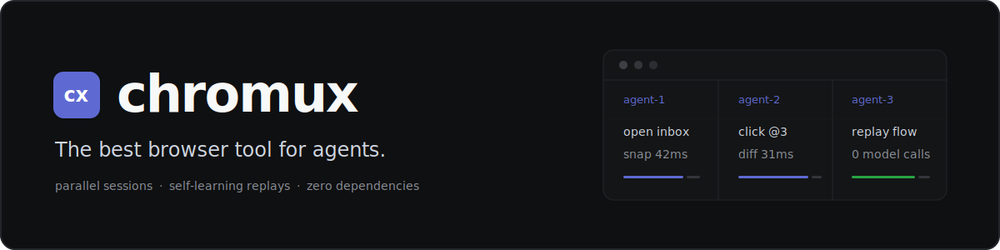

<p align="center">
  
</p>

<p align="center">
  <b>tmux for Chrome tabs — the best browser tool for agents.</b><br>
  Your real Chrome, logged in everywhere, split into a fleet of parallel agent sessions<br>
  that verify actions in ~47 tokens, learn every site they touch, and replay proven flows with zero model calls.
</p>

<p align="center">
  
  
  
</p>

```bash
git clone https://github.com/team-attention/chromux && cd chromux && npm install -g .

# three agents, one logged-in Chrome — separate tabs, zero collisions
chromux open inbox    https://mail.example.com &
chromux open research https://news.ycombinator.com &
chromux open docs     https://developer.mozilla.org &
wait

chromux snapshot inbox --interactive    # page structure with @refs, ~36 tokens
chromux click inbox @3                  # act on a ref…
chromux snapshot inbox --diff           # …verify what changed for ~47 tokens

# freeze a working flow once — every later run replays it with zero model calls
chromux script save mail.example.com/triage --file triage.js
chromux run inbox --script mail.example.com/triage

# or point 10 worker tabs at a URL queue
chromux batch --file urls.txt --workers 10 --out results.jsonl
```

## Why this is the best browser tool for agents

Most "AI browser" tools hand your agent a stranger's browser: a bundled
Chromium with a bot-shaped fingerprint, logged into nothing, reading
20,000-token page dumps, rediscovering every flow from scratch — and paying
for a model call at every step. Your agent deserves better. chromux hands it
**your** browser, and five design bets do the rest:

1. **Your real Chrome, your real logins.** No cloud browser to
   re-authenticate, no extension bridge to babysit, no fingerprint that
   screams "bot". chromux drives real, persistent Chrome profiles over raw
   CDP — log in once, run unattended forever, on macOS, Linux, native
   Windows, WSL, servers, and CI.
2. **Parallel by architecture, not by luck.** One daemon per profile, N
   isolated tab sessions: ten agents browse the same logged-in profile
   concurrently without stepping on each other. `batch` pools workers over
   URL queues with retries and per-host backoff; `pause`/`resume` is the
   one-command kill switch for a whole wave.
3. **It gets smarter every run.** Site notes (`chromux note`) remember
   selectors, quirks, and wait behavior per host and surface automatically on
   the next visit. Working flows freeze with `chromux script save` and replay
   with **zero model calls** — `open` even tells the next agent the script
   exists. When a site changes, the failed replay hands back the script path
   and a repair hint: fix once, replay forever. Most tools start every
   session from zero; chromux compounds.
4. **~47 tokens to verify an action.** Observation payloads are the product:
   on a measured 200-story feed page, full HTML is ~20,400 tokens,
   `snapshot --interactive` is ~7,200 — and checking what an action changed
   with `snapshot --diff` is **~47 tokens**. Extractions can be held to a
   JSON-schema contract with `--schema`, so drift fails loudly. Reproduce it
   all with the checked-in token benchmark (table below).
5. **Zero dependencies. Zero LLM. Zero cloud.** One file on Node.js ≥ 22
   built-ins. chromux is the deterministic hand; your coding agent is the
   brain — no per-step token bills, no vendor lock-in, no data leaving your
   machine.

## How it compares

Measured head-to-head (2026-07, one fixed model — `claude-opus-4-8` — doing
identical browser missions with each CLI, each tool introduced by its own
official skill; full methodology and tables in
[docs/benchmark-2026-07.md](docs/benchmark-2026-07.md)):

| | @playwright/cli 0.1.17 | agent-browser 0.31.1 | chromux 0.16.0 |
|---|---|---|---|
| Browser | Bundled Chromium | Chrome / Chrome for Testing | **Real Chrome, real profiles** |
| Agent task success (10 tasks x reps) | 100% | 92% | **100%** |
| Agent tokens, whole suite | 3.18M | 4.32M | **2.16M** (lowest on all 10 tasks) |
| Agent wall time, whole suite | 14.4min | 23.0min | **13.0min** (fastest on 7/10 tasks) |
| Agent cost, whole suite | $5.62 | $7.31 | **$4.68** |
| Google under bot check | passed, but 72s / 11 turns / 248K tokens | **failed both reps (reCAPTCHA)** | **passed, 22.8s / 4 turns / 74K** |
| Verify one action on a 200-story page | ~28.4K tokens | ~10.9K tokens | **~37 tokens** (`snapshot --diff`) |
| Find one item on that page | ~163 tokens (`find`) | ~10.9K (no find command) | **~59 tokens** (`snapshot --grep`) |
| Warm command latency | slowest (nav p50 883ms) | **fastest (48-95ms)** | 163-218ms |
| Parallel sessions | yes | yes | yes, plus per-profile daemons + `batch` pools |
| Dependencies | playwright + Chromium download | Rust binary via npm | **none (one file, Node ≥ 22)** |
| Logged-in real profiles | no | via `--profile` handoff | **first-class, persistent** |

Honest summary: with a frontier model driving, all three CLIs complete
neutral tasks reliably. On the v2 run chromux is the cheapest and fastest
overall — the lowest token total on every task — because its first
observation rides along with `open` on small pages, one-shot parametrized
snippets replace multi-turn form choreography, and `--grep`/`--diff` keep
large-page reads targeted. playwright-cli remains faster on some individual
external tasks; agent-browser has the best raw command latency but degrades
hardest under bot detection. On two unmodified [MiniWoB++](https://github.com/Farama-Foundation/miniwob-plusplus)
tasks (email-inbox, book-flight — third-party ground truth graded by the
benchmark's own reward code) the first run exposed a real chromux gap:
label-free clickable-`div` micro-UIs defeated accessibility-tree
observation and playwright-cli won both tasks. The 0.17.0 perception
upgrade (behavior-based clickable detection incl. a CDP listener scan,
occlusion-probe overlay surfacing, actions verifying by default, live state
in snapshot lines) flipped both in a fresh same-day three-tool run —
email-inbox 36.4s/178K vs playwright-cli 59.3s/348K — with fixture-page
payloads held byte-identical by a checked-in budget guard. Full history,
loop disclosure, and a Sonnet 5 cross-model check are in
[docs/benchmark-2026-07.md](docs/benchmark-2026-07.md).

Design principles, sharpened against the 2026 agent-browser landscape (see
`docs/competitive-analysis-2026-07.md` in the repo):

- **No agent loop, no bundled LLM.** chromux is the deterministic hand; the
  coding agent driving it is the brain. Tools that embed per-step model calls
  fight cost and flakiness; a saved chromux flow replays for zero tokens, and
  when it breaks, the calling agent is the self-healing layer.
- **The user's real, logged-in profiles, locally.** Cloud browsers rebuild
  identity server-side and extension bridges are fragile; raw CDP over
  persistent local profiles works anywhere a shell works — WSL, servers, CI.
- **Observation payloads are the product.** Agents pay per byte they read
  back: stable snapshot refs, `--interactive`, `snapshot --diff`, and shaped
  `page(...)` extraction under `--schema` keep per-step reading near-constant
  even on large pages (see Token Footprint below).
- **Learning compounds per host.** Site notes (`chromux note`) store durable
  facts, replay scripts (`chromux script`) store proven flows, and both
  surface automatically in `open` responses on the next visit.
- **Parallelism is one profile, many sessions.** A daemon per profile keeps N
  independent tabs live for concurrent agents, with crawl-mode resource caps,
  `batch` worker pools, and `pause`/`resume` as the wave kill switch.

## Prerequisites

- **Node.js >= 22** (for built-in `WebSocket`)
- **Google Chrome** installed
- CLI support: macOS, Linux, and native Windows. The native AppKit status bar
  wrapper is macOS-only.

## Agent Skills

To use chromux as agent browser skills, install the CLI and register the two
repo-local skills with Codex, Claude Code, or Hermes:

- [`install.md`](install.md) — CLI install, skill registration, and smoke test
- [`skills/chromux/SKILL.md`](skills/chromux/SKILL.md) — day-to-day chromux CLI usage
- [`skills/chromux-work/SKILL.md`](skills/chromux-work/SKILL.md) — profile selection, recon, parallel browser work, cleanup, and domain notes
- [`AGENTS.md`](AGENTS.md) — repo guidance for coding agents

## Quick Start

```bash
# Launch Chrome with an isolated profile (auto-finds Chrome, auto-assigns port)
chromux launch
chromux launch work

# Open tabs for two agents
chromux open agent-a https://news.ycombinator.com
chromux open agent-b https://reddit.com/r/programming

# New tabs are background by default so headed Chrome does not steal focus
chromux open agent-c https://example.com

# Label related work for the local activity timeline
CHROMUX_TASK=research-pass chromux open agent-d https://example.com

# Open the local profile/activity companion app
chromux app --open

# Build and install the native macOS app into /Applications (macOS only),
# so Spotlight and Launchpad can find it
./apps/macos-status-bar/install-app.sh

# Each operates independently
chromux snapshot agent-a
chromux click agent-a @3
chromux wait-for-text agent-a "expected text"
chromux run agent-b "return await js('document.title')"
chromux cdp agent-b Runtime.evaluate '{"expression":"location.href","returnByValue":true}'
chromux screenshot agent-a /tmp/hn.png

# Clean up
chromux close agent-a
chromux close agent-b
chromux kill default
```

## Modes

chromux defaults to the compatibility-oriented `default` mode. It preserves the
legacy browser behavior and is the right choice for QA, visual checks, login
flows, and tasks where the page should behave as much like a normal human-driven
Chrome tab as possible.

For crawling, use `crawl` mode:

```bash
CHROMUX_MODE=crawl chromux launch crawl-news --headless
CHROMUX_MODE=crawl CHROMUX_PROFILE=crawl-news chromux open worker-1 https://news.ycombinator.com
CHROMUX_MODE=crawl CHROMUX_PROFILE=crawl-news chromux open worker-1 https://example.com
CHROMUX_MODE=crawl CHROMUX_PROFILE=crawl-news chromux close worker-1
```

For URL batches, use the same crawl mode with `batch`:

```bash
CHROMUX_MODE=crawl CHROMUX_PROFILE=crawl-news \
  chromux batch --file urls.txt --workers 10 --retries 1 --host-backoff-ms 250 --out results.jsonl
```

`batch` reads plain URL lines or JSONL rows with `url`, `source_url`, or `href`,
reuses a worker-tab pool, writes one JSON result per URL, and closes worker
sessions when done.
Each row includes worker/session identity, attempts, duration, final URL/title,
text/html lengths, and a failure kind such as `timeout`, `resource_guard`,
`queue_full`, `session_unresponsive`, `navigation`, `http_or_page`, or
`unknown`.
The summary includes p50/p95 timings, retry count, failure-kind totals, host
backoff settings, and touched host state.

`crawl` mode keeps the public command surface the same, but changes the profile
daemon policy:

- caps expensive profile operations (`CHROMUX_MAX_CONCURRENT_OPS_PER_PROFILE`,
  default `4`)
- caps active sessions (`CHROMUX_MAX_SESSIONS_PER_PROFILE`, default `12`)
- blocks common heavy media, font, and analytics resources
- uses shorter navigation waits (`CHROMUX_NAVIGATION_WAIT_MS`, default `5000`)
- closes idle/stale sessions
- closes CDP-unresponsive sessions so a worker tab can continue with later URLs
- closes initial blank/new-tab targets created during crawl-mode launch
- rejects new work when queue or resource guards are exceeded
- supports `chromux pause` / `chromux resume` as a profile hard-stop
- can optionally recycle long-lived worker tabs after a bounded number of
  navigations
- can optionally compact renderer growth for iframe-heavy crawl pages

For best crawling throughput, use a small worker-tab pool instead of one tab per
URL. For example, process 20 URLs through 3 to 5 stable session names and
repeatedly call `open` on those sessions. Reusing a session navigates the same
tab instead of creating another renderer.

If an orchestrator needs to stop a wave, pause the profile. Existing `close`,
`list`, and `stop` still work, but new browser work is rejected until resumed:

```bash
CHROMUX_PROFILE=crawl-news chromux pause
CHROMUX_PROFILE=crawl-news chromux resume
```

## Profile Management

Each profile is an isolated Chrome instance with its own user-data-dir, logins, cookies, and extensions.

```bash
# Launch named profiles
chromux launch work
chromux launch personal

# See what's running
chromux ps
# PROFILE             PORT    PID       STATUS      TABS
# work                9300    12345     running     3
# personal            9301    12346     running     1

# Machine-readable diagnosis for agents and dashboards
chromux ps --json

# Use a specific profile for tab commands
chromux --profile work open my-tab https://...
CHROMUX_PROFILE=personal chromux open other-tab https://...

# Auto-launch headed Chrome, then keep new tabs in the background by default
CHROMUX_LAUNCH_MODE=headed chromux open bg-tab https://...

# Default profile is "default" — used when no --profile specified
chromux open my-tab https://...  # → uses "default" profile (auto-launches if needed)

# Stop a profile
chromux kill work
```

On macOS, chromux may be invoked from agent runtimes that set `HOME` to a
synthetic profile directory. Chrome's `--user-data-dir` still controls browser
profile isolation, but the Chrome child process is launched with the real macOS
account home so Chrome can initialize its per-user framework services and expose
the DevTools/CDP port reliably.

## Commands

chromux intentionally keeps the visible command surface small. When a new browser
operation is needed, express it with `run` or `cdp` before adding another verb.
The convenience commands below are for common human-like verification loops:
snapshot, act on fresh refs, wait for observable state, then snapshot or
screenshot again. A successful `open`, `click`, `fill`, `type`, or `press`
response is not proof that the page reached the intended state.

### Core Commands

| Command | Description |
|---------|-------------|
| `open <session> <url>` | Create or navigate a tab |
| `open --background <session> <url>` | Explicitly create a new tab without activating it |
| `run <session> <code\|--file PATH\|->` | Run multi-step async JS with `cdp`, `js`, `sleep`, `waitLoad`, `page`, `waitFor`, and `assertPage` helpers |
| `run <session> --page-file PATH` | Run a JS file directly in the page context, bypassing all shell/string escaping |
| `run <session> --script <host>/<name>` | Replay a saved action script deterministically (no model calls) |
| `run <session> ... --schema PATH` | Validate the run result against a JSON-schema subset; mismatches fail with per-path errors |
| `run <session> ... --receipt PATH` | Write a redacted local JSON receipt without storing raw inline code or typed text |
| `script [save\|show\|rm] [<host>/<name>]` | List, save, show, or remove per-host replay scripts |
| `batch --file urls.txt --workers N --retries N --host-backoff-ms MS --out results.jsonl` | Crawl URLs through a worker-tab pool with bounded retry and host backoff |
| `cdp <session> <Method> <params-json>` | Send one raw CDP method to a session |
| `note [host] [--add "text"]` | List, show, or append durable site notes surfaced on `open` |

In default mode, `open` responses include an `interactive` element count and a
`next` field pointing at the snapshot command — inspect page structure first
rather than guessing selectors:

```json
{ "session": "s", "url": "…", "title": "…", "interactive": 359,
  "next": "chromux snapshot s --interactive" }
```

`run --page-file` is the escape-proof path for page scripts. The file contents
are JSON-encoded end to end, so regexes, quotes, and newlines never meet shell
quoting. Write natural statements and `return` a value:

```bash
cat > extract.js <<'EOF'
const rows = [...document.querySelectorAll('a[href]')]
  .map(a => ({ title: a.innerText.trim().split('\n')[0], url: a.href }))
  .filter(r => r.title.length > 8 && /^https?:/.test(r.url));
return rows.slice(0, 10);
EOF
chromux run s --page-file extract.js
```

`run` scripts execute in an async function context:

```bash
chromux run s - <<'JS'
await cdp('Page.navigate', { url: 'https://example.com' });
await waitLoad();
return await js('document.title');
JS
```

`run` executes in the runner context, not directly inside the page. Use `js(...)`
for page expressions or `page(...)` for common page metadata:

```bash
chromux run s - <<'JS'
return await page('({url:location.href,title:document.title,textLength:document.body.innerText.length})');
JS
```

`js(...)` runs page code in an isolated function scope, so lexical declarations
such as `const input = ...` do not leak into later `js(...)` calls for the same
tab. When `chromux run --timeout MS` is provided, that timeout is also used as
the default CDP timeout for `js(...)`, `cdp(...)`, and `page(...)` helper calls
unless the helper call passes its own timeout.

Use `waitFor(...)` and `assertPage(...)` inside `run` when a flow needs
observable readiness proof without extra CLI round trips:

```bash
chromux run s - <<'JS'
await waitFor('#email', { kind: 'selector', timeoutMs: 5000 });
await js("document.querySelector('#email').value='agent@example.com'");
await assertPage('document.readyState === "complete" || document.readyState === "interactive"');
return await page('({url:location.href,title:document.title})');
JS
```

`waitFor` also accepts an **array of fallback candidates** for selector and
text waits — the first candidate that matches wins and is reported back as
`matched`, so saved scripts can carry several locator strategies and survive a
single site change:

```bash
chromux run s - <<'JS'
const found = await waitFor(['#search', 'input[name="q"]', '[role="searchbox"]'], { kind: 'selector', timeoutMs: 5000 });
await js(`document.querySelector(${JSON.stringify(found.matched)}).value = 'chromux'`);
return found;
JS
```

Use `--receipt` when a browser operation should leave replay/debug evidence:

```bash
chromux run s --receipt /tmp/chromux-run-receipt.json - <<'JS'
const ready = await waitFor('Saved', { kind: 'text', timeoutMs: 5000 });
return { ready, page: await page('({url:location.href,title:document.title})') };
JS
```

Receipts store timing, profile/session/mode, code source, result shape, failure
kind, and redaction metadata.
They do not store raw inline code, raw typed text, cookies, authorization
headers, tokens, or secrets.

`cdp` is a thin passthrough:

```bash
chromux cdp s Runtime.evaluate '{"expression":"navigator.userAgent","returnByValue":true}'
```

### Lifecycle

| Command | Description |
|---------|-------------|
| `launch [name]` | Launch Chrome with isolated profile (default: "default") |
| `launch <name> --port N` | Launch with specific port |
| `ps` | List running profiles |
| `ps --json` | List profiles, daemon state, paused state, and resource telemetry as JSON |
| `app [--port N] [--open]` | Serve the local profile/activity companion app |
| `pause [name]` | Hard-stop new browser work for a profile |
| `resume [name]` | Allow browser work again for a paused profile |
| `kill <name>` | Stop profile (Chrome + daemon) |
| `close <session>` | Close tab |
| `list` | List active sessions in current profile |
| `stop` | Stop daemon while keeping Chrome running |

### Convenience Shortcuts

| Command | Description |
|---------|-------------|
| `snapshot <session>` | Accessibility tree with `@ref` numbers (refs stay stable within a document) |
| `snapshot <session> --interactive` | Only interactive elements (smaller payload) |
| `snapshot <session> --diff` | Only lines added/removed since the previous snapshot of this session |
| `snapshot <session> --grep "pattern"` | Only lines matching a case-insensitive regex (literal fallback), plus their ancestor lines for context |
| `snapshot <session> --clickable` | Force behavior-based clickable detection (`cursor:pointer`/`onclick` divs get `@refs`); auto-enabled on pages with almost no standard interactive elements, or when behaviorally-clickable candidates are dense relative to the standard controls in the viewport (div-heavy SPAs behind a standard nav) |
| `click <session> @<ref>` | Click element by ref. Actions verify by default: the response's `changed` field carries the post-action diff (`--verify MS` tunes the settle wait, `--no-verify` skips; also on `fill`/`type`/`press`; crawl mode skips automatically). A click that opens a popup/new tab adopts it automatically and reports it as `newSession` |
| `click <session> "selector"` | Click by CSS selector |
| `click <session> --text "label"` | Click by visible label when refs went stale after a re-render; ambiguous text fails and lists the candidates |
| `click <session> --xy X Y` | Click validated viewport coordinates via CDP mouse events |
| `fill <session> @<ref> "text"` | Fill input field (a native `<select>` matches an option by value or label and fires `change`) |
| `fill <session> @<ref> "se" --pick "Seoul"` | Type, wait for the autocomplete popup, and choose the matching suggestion in one call (the response's `picked` field is the chosen label) |
| `fill <session> @<ref> --file PATH` | Set a file input for upload via `DOM.setFileInputFiles` (repeat `--file` for multiple files) |
| `type <session> "text"` | Insert text into the focused field |
| `press <session> <key>` | Press a supported special key: Enter, Tab, Escape, Backspace, Delete, ArrowUp/Down/Left/Right, Home, End, PageUp, PageDown |
| `download <session> (@ref\|selector\|--url URL) [--to DIR]` | Trigger a download and wait for the completed file; returns the saved path |
| `wait-for-text <session> "text" [timeout-ms]` | Wait until page text appears (same-origin frame text included) |
| `wait-for-selector <session> "selector" [timeout-ms]` | Wait until a selector is visible; add `--gone` to wait until it disappears |
| `screenshot <session> [path]` | Take PNG screenshot |
| `show <session>` | Open DevTools in browser (inspect live tab, even headless) |

Snapshots, clicks, fills, and waits pierce same-origin iframes and open shadow
DOM: elements inside them get normal `@refs` and are clicked at their true
top-viewport coordinates. Cross-origin frames are marked
`iframe (cross-origin; content not accessible)` in snapshots; closed shadow
roots stay invisible. Native JS dialogs (`alert`/`confirm`/`prompt`) are
auto-handled per session policy (`open <s> <url> --dialog accept|dismiss`,
default dismiss, `beforeunload` always accepted) and reported in the next
action response's `dialog` field, so a stray alert can no longer brick a
session. In `run`, `waitFor` additionally supports `{kind: 'gone'}` (element
disappeared) and `{kind: 'network-idle', idleMs: 500}` (no in-flight page
requests) for deterministic waits without `sleep()`.

Snapshot `@ref` numbers are stable within a document: re-snapshotting the same
page keeps existing refs and only assigns new numbers to new elements, so refs
held by an agent stay valid until navigation replaces the document. Building on
that, `snapshot --diff` prints only the lines added and removed since the
previous snapshot of that session (any action in between), with a one-line
summary of how many unchanged lines were omitted — after several actions on a
large page this is a fraction of a full snapshot. The first `--diff` call, or
one after a navigation, falls back to a full snapshot and says why.

`snapshot --grep "pattern"` answers "where is X on this page" without paying
for the whole tree: it keeps only the lines matching the pattern plus each
match's ancestor lines, so the agent still sees which form or section a match
lives in. On a 200-story feed a targeted grep is typically a few dozen tokens
instead of ~14K.

`click` brings the tab forward before acting. Ref/selector clicks scroll the
target into view and fail when the element is hidden, zero-size, stale, outside
the viewport after scroll, or covered by another element at the click point.
Coordinate clicks validate that `X,Y` are inside the current viewport. `fill`
updates input state through the native value setter and dispatches input/change
events so common frontend frameworks observe the value.

Known reach limits, stated so agents report instead of blind-retrying:
snapshot value display masks `type=password` only; values in plain text
fields appear as-is. Cross-origin iframes and closed shadow roots are not
reachable (marked in snapshots where detectable). Clickable auto-detection
evaluates the current viewport — controls far below the fold may need a
scroll (or `--clickable`) before they get refs. Verify diffs skip the
per-element CDP listener re-scan: an element revealed by an action whose only
click affordance is a JS listener (no cursor style, no `onclick`) shows up as
text without a clickable `@ref` — take a snapshot to get its ref.

### Watch / Debug

| Command | Description |
|---------|-------------|
| `watch <session> console` | Capture console logs, enabling capture on first call |
| `watch <session> console --off` | Disable console capture |
| `watch <session> network` | Capture failed requests |
| `watch <session> network --all` | Capture all requests |
| `watch <session> network --off` | Disable network capture |

### Compatibility Aliases

The older `eval`, `scroll`, `wait`, `console`, `network`, and `scroll-until`
commands remain available for existing automation and do not print deprecation
warnings. They are intentionally hidden from the main help surface.

`scroll-until` is now documented as runner material in
`snippets/_builtin/scroll-until.js`; copy or adapt that file when a task needs the
pattern.

### Builtin Runner Snippets

The checked-in snippets under `snippets/_builtin/` are reusable `chromux run`
scripts, not public commands.
They cover common fast paths:

- `scroll-until.js`: infinite scroll and result growth loops.
- `page-extract.js`: structured page metadata extraction without full body text
  or HTML dumps.
- `form-flow.js`: whole-form fill (inputs and native selects), submit, and
  readiness proof in one call.
- `table-extract.js`: a table as `{headers, rows}` without dumping HTML.
- `paginate-collect.js`: collect items across paginated pages with per-page
  field extraction.
- `wizard-flow.js`: multi-step wizards with per-step readiness proof.
- `search-and-pick.js`: type → pick suggestion → submit → report.
- `network-errors.js`: browser-observable broken resource diagnostics.
- `page-assert.js`: selector, text, and DOM assertion proof.

Deeper task-type guides load on demand so the per-turn skill text stays
small: `chromux skill` lists topics; `chromux skill forms|extraction|recovery`
prints the guide (autocomplete `--pick` patterns, pagination and table
extraction, dialog/popup recovery, and the pause → `open --foreground` →
wait → resume human login handoff).

Run them with `--file`, passing parameters as repeatable `--arg key=value`
flags — values that parse as JSON arrive structured, everything else stays a
string, and run code reads them from the `args` object:

```bash
chromux run s --file snippets/_builtin/form-flow.js \
  --arg fields='{"#email":"a@b.c","#country":"US"}' \
  --arg submit='#submit' --arg readyText='Order confirmed'
chromux run s --file snippets/_builtin/page-assert.js --arg selector='#done'
```

### Local Benchmarks

The deterministic benchmark harness starts a local fixture server and exercises
real Chrome through the CLI:

```bash
CHROMUX_HOME="$(mktemp -d /tmp/chromux-bench-XXXXXX)" \
  node benchmarks/chromux-benchmark.mjs --smoke --out /tmp/chromux-benchmark.json
```

It reports cold launch, warm `ps --json`, `open`, `run`, full snapshot,
interactive snapshot, screenshot, click/fill/wait style interaction, and
`batch` p50/p95 timings.
Use it before and after automation changes when performance or scheduler
behavior matters.

### Token Footprint

Agents pay for every byte they read back, so observation payload size is a
first-class metric. The deterministic token benchmark measures the
agent-visible stdout of common observation commands on local fixture pages
(bytes are exact; tokens are estimated as chars/4):

```bash
CHROMUX_HOME="$(mktemp -d /tmp/chromux-tokens-XXXXXX)" \
  node benchmarks/chromux-token-benchmark.mjs --out /tmp/chromux-tokens.json
```

Representative run (real Chrome, deterministic fixtures; the feed page has
200 stories with ~600 interactive elements):

| command | article page | form page | 200-item feed |
|---|---|---|---|
| full page HTML (`run` outerHTML) | ~790 tok | ~326 tok | ~22,430 tok |
| `snapshot` (full) | ~775 tok | ~67 tok | ~14,252 tok |
| `snapshot --interactive` | ~41 tok | ~38 tok | ~7,153 tok |
| `snapshot --diff` after one action | ~36 tok | ~39 tok | **~45 tok** |
| `snapshot --grep` (find one item) | — | — | **~59 tok** |
| structured extract (`run` + shaped `page(...)`) | ~25 tok | ~27 tok | ~27 tok |

The workflow the skills teach — inspect structure with `--interactive`, verify
each action with `--diff`, extract with a shaped `page(...)` result (optionally
enforced by `--schema`) — keeps per-step observation payloads roughly constant
even on large pages, instead of re-reading the whole tree every step.

### Cross-Tool Benchmarks

Two checked-in harnesses compare chromux, vercel-labs/agent-browser, and
@playwright/cli under identical conditions (results summarized in
[How it compares](#how-it-compares); full methodology, tables, and fairness
rules in [docs/benchmark-2026-07.md](docs/benchmark-2026-07.md)):

```bash
# Agent-in-the-loop: one fixed model does identical browser missions with each
# CLI; measures wall time, tokens, turns, and machine-graded success.
# Requires an authenticated `claude` CLI. ~78 Opus sessions (~$18) per full run.
node benchmarks/agent-compare-benchmark.mjs --out /tmp/agent-compare.json
node benchmarks/agent-compare-benchmark.mjs --smoke   # cheap harness check

# Deterministic (no LLM): payload bytes + warm latency for equivalent
# observation commands, plus a parallel-session isolation probe.
node benchmarks/compare-benchmark.mjs --out /tmp/compare.json
```

Competitor CLIs are installed at their latest versions into a temp prefix at
run start; nothing is added to chromux's runtime dependencies.

## Architecture

```
~/.chromux/
  config.json                    Global config (optional)
  profiles/
    default/                     Chrome user-data-dir
      .state                     PID, Chrome CDP port, daemonPort cache
    work/
      .state

Chrome instance A (port 9300, ~/.chromux/profiles/default/)
  ↑ CDP WebSocket per tab
chromux daemon (localhost TCP 127.0.0.1:9400)
  ↑ HTTP
CLI / AI agents

Chrome instance B (port 9301, ~/.chromux/profiles/work/)
  ↑ CDP WebSocket per tab
chromux daemon (localhost TCP 127.0.0.1:9401)
  ↑ HTTP
CLI / AI agents

chromux status app (local HTTP)
  ↑ reads profile state, activity logs, and site notes
~/.chromux/activity/events.jsonl
~/.chromux/activity/aggregates.json
```

- **No Playwright/Puppeteer** — raw `WebSocket` + `http` from Node.js stdlib
- **Tab CRUD** via Chrome's `/json/*` HTTP endpoints
- **Page ops** via CDP WebSocket JSON-RPC
- **Daemon per profile** keeps WebSocket connections alive across CLI invocations
- **Localhost TCP daemon transport** binds profile daemons to `127.0.0.1` on
  macOS, Linux, and Windows; `.state.port`/`.state.cdpPort` remain Chrome CDP
  ports, while `.state.daemonPort` is the daemon HTTP endpoint
- **Auto-launch** — `chromux open` auto-launches default profile if needed
- **Profile adoption** — `.state` is a cache, not the source of truth; `chromux ps`,
  `launch`, `open`, and `kill` rediscover live Chrome processes from
  `--user-data-dir` + CDP when daemon endpoint or state files drift or disappear
- **Cold-start coordination** — concurrent first `open` calls for the same profile
  share one startup lock so only one process launches Chrome and the daemon while
  the others wait for the profile daemon endpoint to become healthy.
- **macOS agent-home compatibility** — chromux state follows the invoking
  process `HOME`, while the Chrome child uses the real account home on macOS;
  `--user-data-dir` still keeps the Chrome profile isolated
- **Local activity log** — CLI commands append local JSONL events with profile,
  session, command, result, duration, Task label, and full URL/title when
  available; Chrome History files are not read
- **Companion status app** — `chromux app` serves a zero-dependency local UI for
  profile status, raw events, Task timeline, site-note links, retention,
  deletion, and redaction
- **Windows Chrome discovery** — native Windows CLI runs auto-discover Google
  Chrome Stable from normal Program Files or LocalAppData installations, while
  explicit `chromePath` remains available for custom locations
- **macOS app** — `apps/macos-status-bar` builds a native AppKit
  menu bar app that starts the local status server and opens the dashboard in a
  WebKit window; native app packaging is macOS-only
- **macOS release package** — `apps/macos-status-bar/package-release.sh` creates
  a zipped `.app` bundle for GitHub Releases and manual downloads

## Configuration

Optional `~/.chromux/config.json`:

```json
{
  "chromePath": "/Applications/Google Chrome.app/Contents/MacOS/Google Chrome",
  "portRangeStart": 9300,
  "portRangeEnd": 9399,
  "daemonPortRangeStart": 9400,
  "daemonPortRangeEnd": 9499
}
```

On Windows, Chrome Stable is auto-discovered from normal Program Files or
LocalAppData install locations. Use `chromePath` only for custom locations, for
example `C:\\Program Files\\Google\\Chrome\\Application\\chrome.exe`.

## Launch Modes

chromux supports two Chrome launch modes:

- `headless`: no visible Chrome window. This is the default auto-launch mode
  unless `CHROMUX_LAUNCH_MODE` is set.
- `headed`: normal visible Chrome window.

By default, `chromux open` creates new tabs in the background so a visible headed
profile does not come to the front for each new session:

```bash
chromux launch work
CHROMUX_PROFILE=work chromux open tab https://example.com
```

Per-command equivalents are available:

```bash
chromux open --background tab https://example.com
chromux open --no-focus tab https://example.com
chromux open --foreground tab https://example.com
```

## Environment

| Variable | Default | Description |
|----------|---------|-------------|
| `CHROMUX_PROFILE` | `default` | Active profile name |
| `CHROMUX_MODE` | `default` | Browser policy mode: `default` for compatibility/QA, `crawl` for efficient crawling |
| `CHROMUX_TASK` | empty | Optional Task label written to activity events and used by the status app timeline |
| `CHROMUX_HOME` | `~/.chromux` | Override chromux state root for tests or isolated runs |
| `CHROMUX_LAUNCH_MODE` | `headless` for auto-launch | Auto-launch mode used by tab commands when a profile is not running: `headless` or `headed` |
| `CHROMUX_OPEN_BACKGROUND` | `1` | New tabs are created through `Target.createTarget({ background: true })` by default. Set to `0`, `false`, `no`, or `off`, or pass `open --foreground`, to activate new tabs instead |
| `CHROMUX_MAX_CONCURRENT_OPS_PER_PROFILE` | `4` in crawl, unlimited in default | Maximum expensive daemon operations running at once |
| `CHROMUX_MAX_QUEUED_OPS_PER_PROFILE` | `16` in crawl, unlimited in default | Maximum queued expensive operations before new requests are rejected |
| `CHROMUX_MAX_SESSIONS_PER_PROFILE` | `12` in crawl, unlimited in default | Maximum active sessions before new sessions are rejected |
| `CHROMUX_IDLE_TTL_MS` | `20000` in crawl, disabled in default | Idle session age before the daemon closes the tab |
| `CHROMUX_SESSION_TTL_MS` | `300000` in crawl, disabled in default | Maximum session age before the daemon closes the tab |
| `CHROMUX_NAVIGATION_WAIT_MS` | `5000` in crawl, `30000` in default | Navigation wait budget for `open` |
| `CHROMUX_MAX_CHROME_PROCESSES_PER_PROFILE` | `60` in crawl, disabled in default | Reject new opens when profile Chrome process count reaches this value |
| `CHROMUX_MAX_RENDERERS_PER_PROFILE` | `40` in crawl, disabled in default | Reject new opens when profile renderer count reaches this value |
| `CHROMUX_MAX_RSS_MB_PER_PROFILE` | `12000` in crawl, disabled in default | Reject new opens when profile Chrome RSS reaches this value |
| `CHROMUX_BLOCK_RESOURCES` | `1` in crawl | Set to `0` to disable crawl mode media/font/analytics blocking |
| `CHROMUX_CLOSE_INITIAL_TABS` | `1` in crawl | Set to `0` to keep initial blank/new-tab targets on launch |
| `CHROMUX_MAX_NAVIGATIONS_PER_SESSION` | `0` | Recreate a worker tab after this many `open` navigations; disabled by default because it can raise short-term renderer peaks |
| `CHROMUX_COMPACT_RENDERERS` | `0` | Opt into crawl-only Chrome flags that reduce renderer growth on iframe-heavy pages; keep disabled for broad compatibility |
| `CHROMUX_RENDERER_PROCESS_LIMIT` | `8` in compact mode | Renderer process cap passed to Chrome when compact renderer mode is enabled |
| `CHROMUX_EXTRA_CHROME_ARGS` | empty | Extra Chrome launch args, split like shell words |
| `CHROMUX_CLI_TIMEOUT_MS` | `90000` in crawl, `30000` in default | Default CLI request timeout for commands such as `open` |

## Saved Action Scripts

Scripts close the observe-once, replay-forever loop: when an agent has derived
a working flow for a site (selectors, waits, extraction), it saves the flow as
a plain `run` script under `~/.chromux/scripts/<host>/<name>.js`. Later runs
replay it deterministically with zero model calls:

```bash
cat > top-links.js <<'EOF'
const ready = await waitFor('a[href]', { kind: 'selector', timeoutMs: 5000 });
return await page(`({
  title: document.title,
  links: [...document.querySelectorAll('a[href]')].slice(0, 10)
    .map(a => ({ text: a.innerText.trim(), url: a.href })),
})`);
EOF
chromux script save news.ycombinator.com/top-links --file top-links.js
chromux run s --script news.ycombinator.com/top-links
```

- `open` responses list saved scripts for the page's host (`scripts` and a
  ready-to-run `replay` command), so agents reuse proven flows instead of
  re-deriving them.
- Host matching walks parent domains like site notes: a script saved under
  `naver.com` also surfaces and resolves on `search.naver.com`.
- Record fallback locators inside scripts with `waitFor([...candidates])` —
  the wait resolves to whichever candidate matches (`matched`), so one site
  change does not break the replay.
- When a replay fails, the error names the script path and ends with a repair
  hint — the calling agent snapshots the page, fixes the flow, and
  `chromux script save`s it again. The agent is the self-healing layer; the
  CLI stays deterministic.
- Add `--schema contract.json` to any `run` to enforce an extraction contract.
  The result is validated against a JSON-schema subset (`type`, `required`,
  `properties`, `items`, `enum`, `const`, `pattern`, `min*`/`max*`,
  `additionalProperties: false`); mismatches exit non-zero with per-path
  errors and a result preview, and receipts record `failureKind:
  "schema_mismatch"`.

## Site Knowledge

chromux surfaces durable, non-secret site notes from
`~/.chromux/skills/<host>/*.md` in `open` responses (the `hints` field), and
`close` responses point at the host's note directory via `knowledgeHint`. Host
matching walks up parent domains, so notes saved under `naver.com` also
surface on `search.naver.com` pages.

The `note` command is the write side of that loop:

```bash
chromux note                                  # list hosts with notes
chromux note naver.com                        # show notes (includes parent domains)
chromux note naver.com --add "search results: snapshot --interactive shows result titles as @refs"
```

When a `close` or `kill` follows recent failed commands on a host that has no
notes yet, chromux prints a one-line reminder pointing at `chromux note` — the
activity log already holds the per-command errors that make such notes worth
writing.

## Activity Log And Status App

chromux records local activity events for CLI usage under
`~/.chromux/activity/events.jsonl`. Events include timestamp, profile, session,
command, sanitized command arguments, result, duration, optional `CHROMUX_TASK`,
and the full URL/title/host when the command result exposes page state. Input
text for `fill` and `type`, and inline code for `run` and `eval`, are not stored
as raw arguments.

The default full-URL retention is 90 days. The status app can set retention to
7, 30, 90, 365 days, or unlimited, delete all/profile/Task raw events, and
redact URL/title/host fields while preserving command aggregate counters in
`~/.chromux/activity/aggregates.json`.

Start the app locally:

```bash
chromux app
chromux app --port 9341 --open
```

The app lists known profiles, selected profile state, daemon/session counts when
available, per-profile disk usage (plus the total across profiles), active-first
profile sorting, search/status filters, bulk profile selection/deletion, raw
command events, Task-first timeline groups, fallback session windows, and site
knowledge note paths under `~/.chromux/skills/<host>/*.md`. V1 does not read
Chrome History.

On macOS, use the GitHub Release asset when you want a real menu bar app instead
of a browser tab. The release zip contains `chromux.app`; unzip it, move it to
`/Applications` if desired, and open it from Finder:

```bash
unzip chromux-macos-<version>.zip
open "chromux.app"
```

The release app still requires Node.js >= 22 on the Mac. It does not install or
update the global `chromux` CLI. It runs the bundled `chromux.mjs` and dashboard
with the local `node` binary, looking at `CHROMUX_NODE`, common Homebrew/system
paths, and then `PATH`. If macOS blocks an unsigned download on first launch,
use Control-click > Open or approve it in System Settings > Privacy & Security.

The one-pass setup in `install.md` has agents ask macOS users whether to also
install the menu bar app, then builds it from the checkout (or downloads the
latest release app without the Xcode Command Line Tools), copies it to
`/Applications/chromux.app`, and launches it. If `/Applications` is not
writable, it falls back to `~/Applications/chromux.app`.

From a repo checkout, build and install the same native wrapper into
`/Applications` so Spotlight and Launchpad can find it (requires the Xcode
Command Line Tools):

```bash
./apps/macos-status-bar/install-app.sh
```

For a quick dev loop without installing, build and launch from `dist/`:

```bash
./apps/macos-status-bar/build.sh
open "apps/macos-status-bar/dist/chromux.app"
```

To produce the GitHub Release zip on macOS:

```bash
./apps/macos-status-bar/package-release.sh
ls apps/macos-status-bar/release/
```

The wrapper adds a `cx` item to the macOS status bar, starts the same local
dashboard server, and exposes menu actions for opening the dashboard, opening it
in a browser, restarting the server, toggling Launch at Login, and quitting.
The `cx` menu also refreshes and shows currently active profiles when it opens.

## License

MIT
